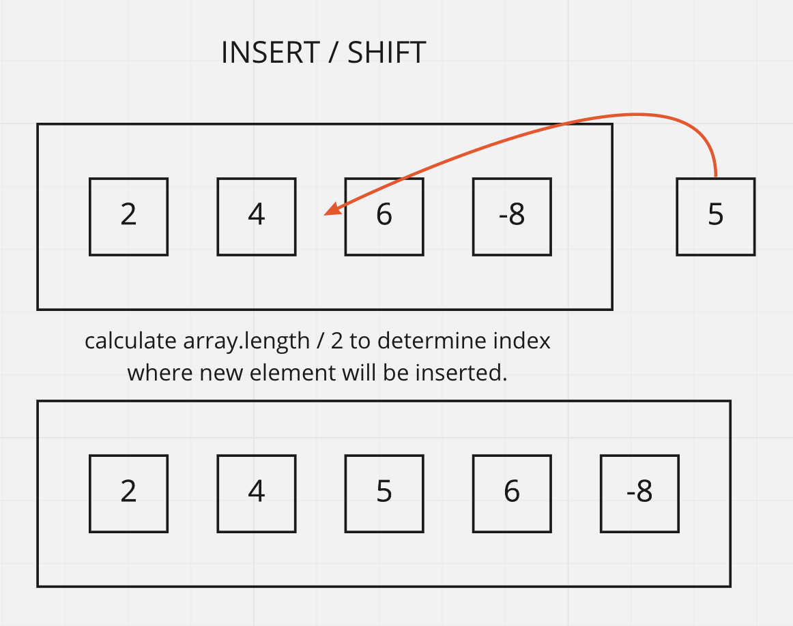

# Insert / Shift Array

Includes a function that takes in an array and a value to be added, and returns an array with the new value added at the middle index.

## Inputs / Outputs

Input: `[2,4,6,-8], 5` | `[42,8,15,23,42], 16`\
Output: `[2,4,5,6,-8]` | `[42,8,15,16,23,42]`

## Algorithm

If we take the length of the array and divide it in half, we could find the index where we would need to insert the new value.

- Declare a variable with this index.
- Use splice to insert the element. (But I don't think it's that simple.)
- Return the array.

- (An alternative would be dividing the array in half and using a for loop, but I'm not yet totally clear on how to execture this.)

## Pseudocode

```plaintext
function insertShiftArray takes in `arr` and `val`

declare idx = arr.length / 2
return arr.splice(idx, 0, val)
```

## Whiteboard Process



[back](../README.md)
