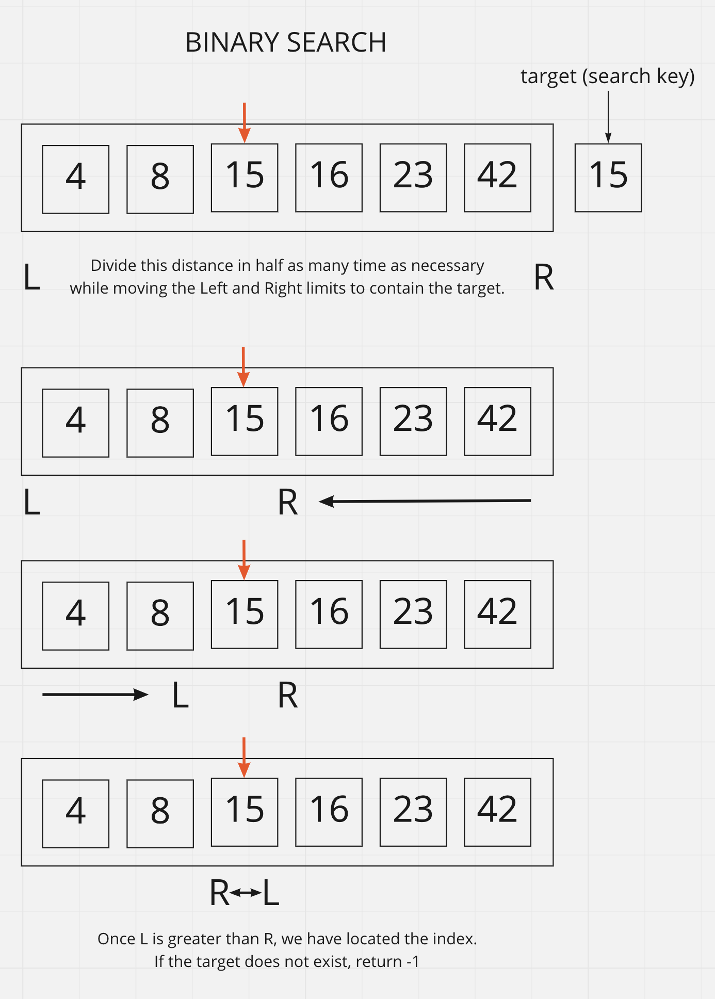

# Binary Search of Sorted Array

Includes a function that takes in two parameters: a sorted array and the search key. It returns the index of the array’s element that is equal to the value of the search key or -1 if the element is not in the array.

## Inputs / Outputs

Input:

`[4, 8, 15, 16, 23, 42], 15`\
`[-131, -82, 0, 27, 42, 68, 179], 42`\
`[11, 22, 33, 44, 55, 66, 77], 90`\
`[1, 2, 3, 5, 6, 7], 4`

Output:

`2`, `4`, `-1`, `-1`

## Whiteboard Process



## Algorithm

If we take the length of the array and divide it in half, we could find the index where the search key exists.

- Declare variables for Left and Right.
- Run a while loop to determine the midpoint between Left and Right.
  - As the loop runs, the length between Left and Right will divide by 2.
- If Left becomes greater than Right, the loop will end.
- Return -1 if the search key is not in the array.

## Pseudocode

```plaintext
function BinarySearch takes in `arr` and `key`

  declare left to equal 0
  declare right to equal arr.length -1

  while left <= right
    declare mid = (left + right) / 2
    if arr[mid] = key
      return mid
    else if (target < arr[mid])
      right = mid - 1
    else
      left = mid + 1
      
  return -1
```


[back](../README.md)
