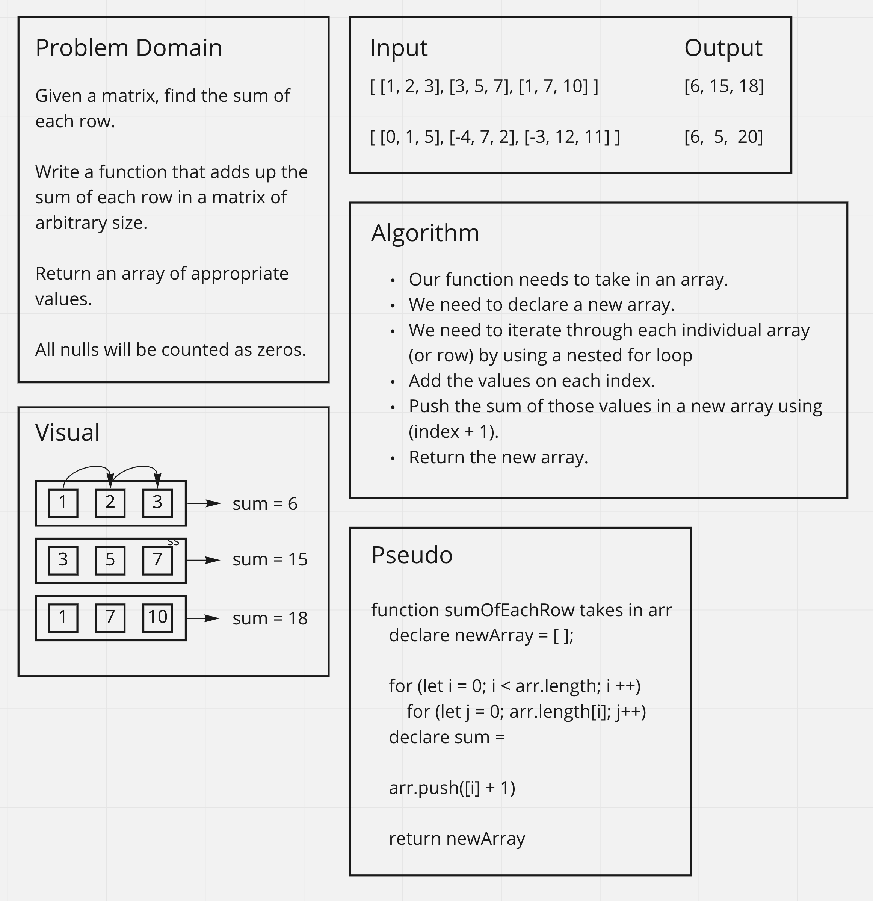

# Matrix Sum of Each Row

Write a function to add up the sum of each row in a matrix of arbitrary size, and return an array with the appropriate values. The matrix will always be full of integers. Negative values are possible. All nulls will be counted as zeros.

## Inputs / Outputs

Input:

`[ [1, 2, 3], [3, 5, 7], [1, 7, 10] ]`\
`[ [0, 1, 5], [-4, 7, 2], [-3, 12, 11] ]`\

Output:

`[6, 15, 18]`\
`[6, 5, 20]`

## Whiteboard Process

[back](../README.md)
