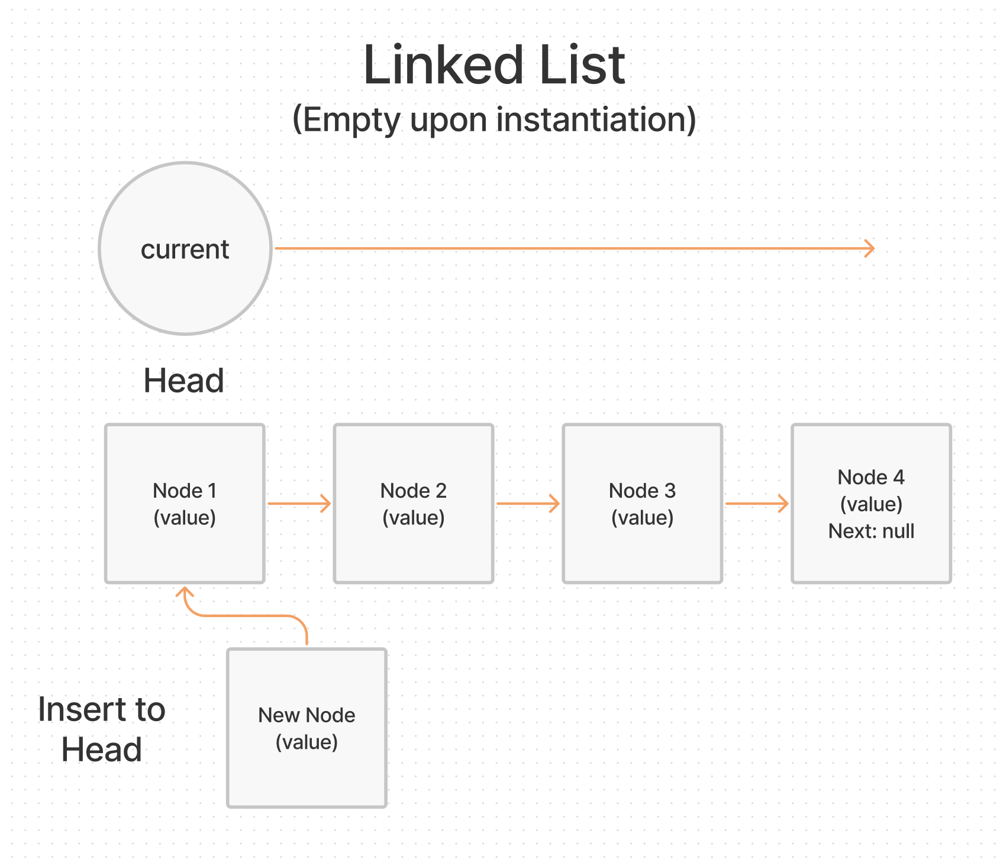

# Implementation: Singly Linked Lists

## Problem Domain

Node: Create a Node class that has properties for the value stored in the Node, and a pointer to the next Node.

Linked List: Create a Linked List class. Within your Linked List class, include a head property. Upon instantiation, an empty Linked List should be created.

The class should contain the following methods:

- `insert`
  - Arguments: value
  - Returns: nothing
  - Adds a new node with that value to the head of the list with an O(1) Time performance.
- `includes`
  - Arguments: value
  - Returns: Boolean
  - Indicates whether that value exists as a Node’s value somewhere within the list.
- `to string`
  - Arguments: none
  - Returns: a string representing all the values in the Linked List, formatted as:
`"{ a } -> { b } -> { c } -> NULL"`

Any exceptions or errors that come from your code should be semantic, capture-able errors. For example, rather than a default error thrown by your language, your code should raise/throw a custom, semantic error that describes what went wrong in calling the methods you wrote for this lab.

## Whiteboard Process



## Algorithm

Create a Node class with a constructor with properties for the value and next.

Create a LinkedList class with a constructor with a property for the head. Create the following methods:

Insert:

- Create a new node that takes in a value. Set the next property of the new node as the current head. The head will be equal to the new node.

Includes:

- Using a while loop, current will be truthy. If current value equals search value, return true. Current will be current.next to traverse the list. Return false if value is outside of the list.

To String:

- Declare a variable with an empty string. Using a while loop, current will be truthy. Add current node value to the empty string. Add a value of null to the string outside of the loop.

## Pseudocode

```plaintext
class Node
  constructor takes in value
    this.value equals value
    this.nex equals null

class LinkedList
  constructor
    this.head equals null

  insert
    declare newNode to equal new Node, takes in value
    newNode.next equals head
    head equals newNode

  includes
    current equals head
    while current
      if current value equals value
        return true

      current equals current.next

    return false

  toString
    current equals head
    declare empty string
    while current
      add current value to empty string
      current equals current.next

    return string by adding 'NULL'
```

[back](../README.md)
