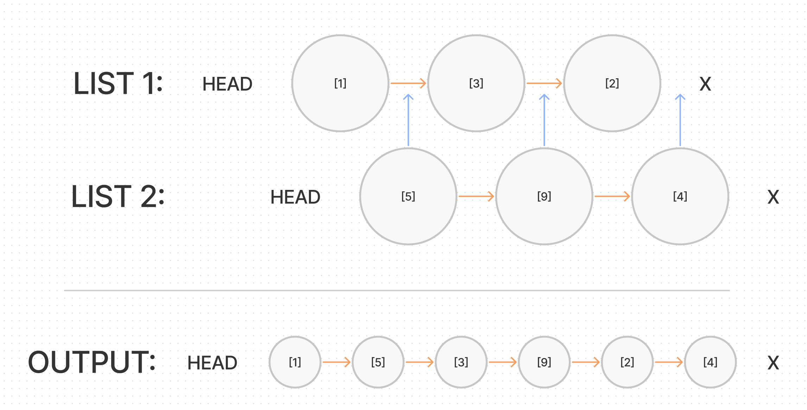

# Zip Two Linked Lists

## Problem Domain

Write a function called zip lists

- Arguments: 2 linked lists
- Return: Linked List, zipped as noted below
- Zip the two linked lists together into one so that the nodes alternate between the two lists and return a reference to the head of the zipped list.
- Try and keep additional space down to O(1)
- You have access to the Node class and all the properties on the Linked List class as well as the methods created in previous challenges.

## Inputs / Outputs

`zipLists(list1, list2)`

| Arg `list1`                      	| Arg `list2`                  	| Output                                                	|
|----------------------------------	|----------------------------------	|-------------------------------------------------------	|
| `head -> [1] -> [3] -> [2] -> X` 	| `head -> [5] -> [9] -> [4] -> X` 	| `head -> [1] -> [5] -> [3] -> [9] -> [2] -> [4] -> X` 	|
| `head -> [1] -> [3] -> X`        	| `head -> [5] -> [9] -> [4] -> X` 	| `head -> [1] -> [5] -> [3] -> [9] -> [4] -> X`        	|
| `head -> [1] -> [3] -> [2] -> X` 	| `head -> [5] -> [9] -> X`        	| `head -> [1] -> [5] -> [3] -> [9] -> [2] -> X`        	|

## Whiteboard Process



## Algorithm

Create a Node class with a constructor with properties for the value and next.

Create a LinkedList class with a constructor with a property for the head. Create the following methods:

`zipLists(list1, list2)`

- Use any necessary methods from the previous Linked List challenges:
  - `append(val)`
  - `insertBefore(val)`
  - `insertAfter()`
  - `kthFromEnd(k)`

Given the two lists as arguments, the first list should become the output and the second list should become *empty*.

- The Nodes of the second list should be ***inserted*** when there are positions available by using a while loop.
- Each list will have their own current and next variables
- These nodes will need to be alternated inside the loop

## Pseudocode

```plaintext
function zipLists(list1, list2)
  declare current1 = list1, current2 = list2
  declare next1, next2

  while current1 & current2 {

    declare next1 = current1.next1
    declare next2 = current2.next1

    // make current2 as next of current1 (alternate nodes)
    current2.next2 = next1
    current1.next1 = next2 

    // update current
    current1 = next1
    current2 = next2
  }

  // update list2 head
  list2 = current2

  return list2


(still need to create and implement insert method)
```

## Code

[Linked List Zip](./linked-list.js)

[back](../README.md)
