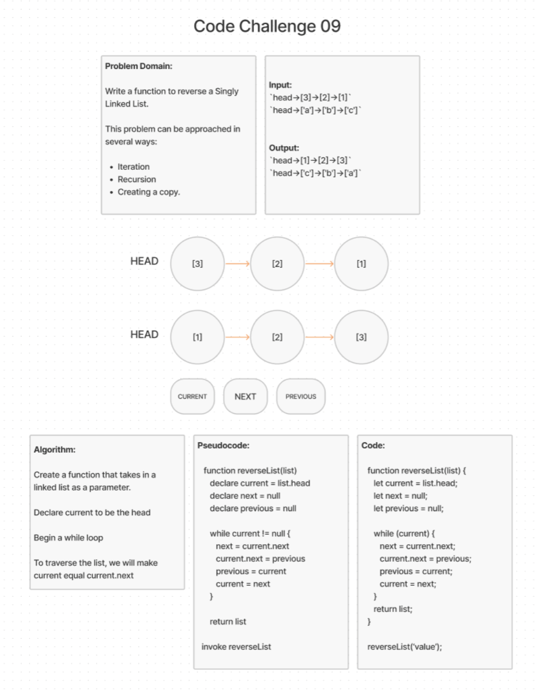

# Matrix Sum of Each Row

write a function to reverse a Singly Linked List. This problem can be approached using iteration, recursion, or creating a copy of the linked list.

## Inputs / Outputs

Input:

`head->[3]->[2]->[1]`\
`head->['a']->['b']->['c']`

Output:

`head->[1]->[2]->[3]`\
`head->['c']->['b']->['a']`

## Whiteboard Process

[back](../README.md)
