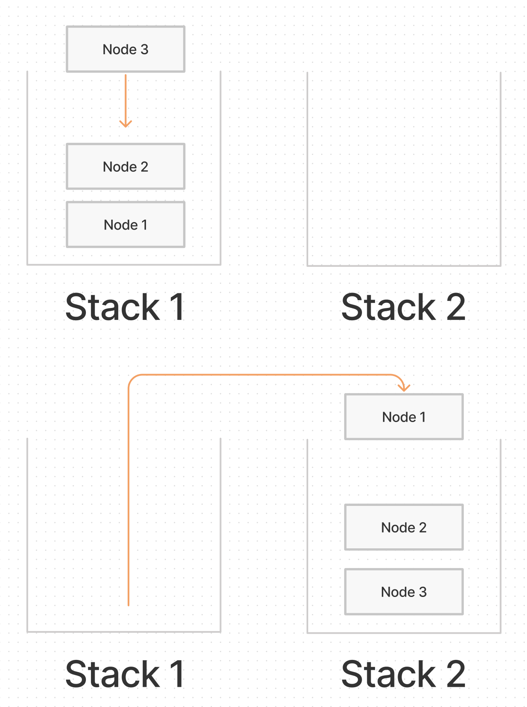

# Pseudo Queue

## Problem Domain

Create a new class called pseudo queue.

- Do not use an existing Queue.
- Instead, this PseudoQueue class will implement our standard queue interface (the two methods listed below),
- Internally, utilize 2 `Stack` instances to create and manage the queue

Methods:

- enqueue
  - Arguments: value
  - Inserts value into the PseudoQueue, using a *first-in, first-out* approach.
- dequeue
  - Arguments: none
  - Extracts a value from the PseudoQueue, using a *first-in, first-out* approach.

*NOTE: The `Stack` instances have only `push`, `pop`, and `peek` methods. You should use your own Stack implementation. Instantiate these Stack objects in your PseudoQueue constructor.*

## Inputs / Outputs

`enqueue(value)`

| Input              	| Args 	| Output                  	|
|--------------------	|------	|-------------------------	|
| `[10]->[15]->[20]` 	| `5`  	| `[5]->[10]->[15]->[20]` 	|
|                    	| `5`  	| `[5]`                   	|

`dequeue()`

| Input                   	| Output 	| Internal State    	|
|-------------------------	|--------	|-------------------	|
| `[5]->[10]->[15]->[20]` 	| `20`   	| `[5]->[10]->[15]` 	|
| `[5]->[10]->[15]`       	| `15`   	| `[5]->[10]`       	|

## Whiteboard Process

## Algorithm

Create 2 stacks from a psuedo queue class with a constructor.

- Enqueue function will take in a value, enabling stack one to push that value
- Dequeue function will check if either stack is empty.
  - If both stacks are empty, we will throw an error
  - If only stack two is empty, we will pop off of stack one and push that value onto stack two.
  - Otherwise we pop off of stack two and return the top value

## Code

[PseudoQueue](./pseudo-queue.js)

[back](../README.md)
