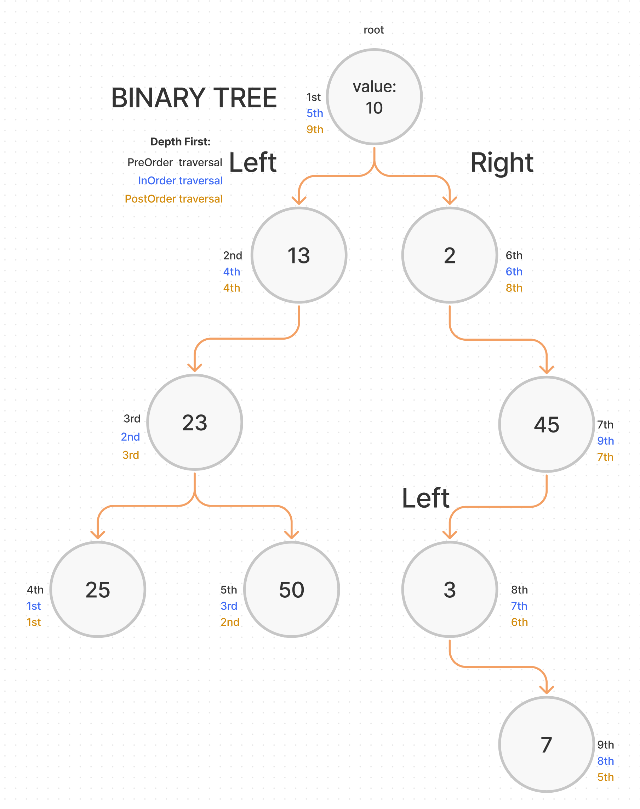

# Implementation: Binary Tree and BST

## Challenge

### **Node**

Create a Node class that has properties for the value stored in the node, the left child node, and the right child node.

### **Binary Tree**

Create a Binary Tree class

- Define a method for each of the depth first traversals:
  - pre order
  - in order
  - post order which returns an array of the values, ordered appropriately.
- Errors should be semantic, capture-able errors.

### **Binary Search Tree**

Create a Binary Search Tree class

- This class should be a sub-class (or your languages equivalent) of the Binary Tree Class, with the following additional methods:
- Add
  - Arguments: value
  - Return: nothing
  - Adds a new node with that value in the correct location in the binary search tree.
- Contains
  - Argument: value
  - Returns: boolean indicating whether or not the value is in the tree at least once.

## Approach & Efficiency

I used a recursive approach. All three binary tree methods (pre-order, in-order, post-order) have O(n) time efficiency.

### Whiteboard Process

## Code

[Binary Tree](./binary-tree.js)

[back](../README.md)
