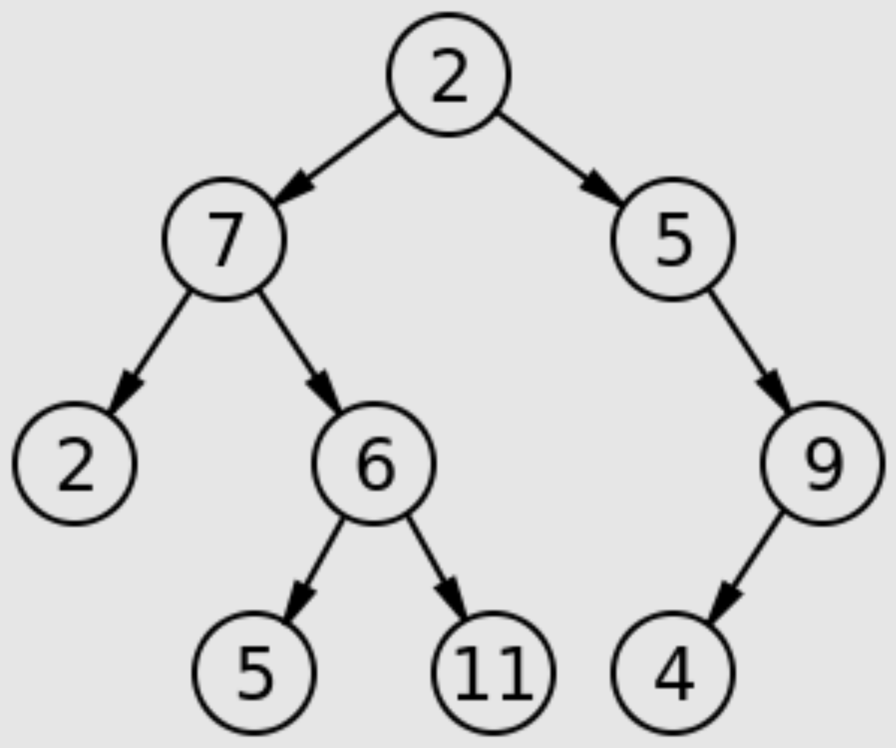
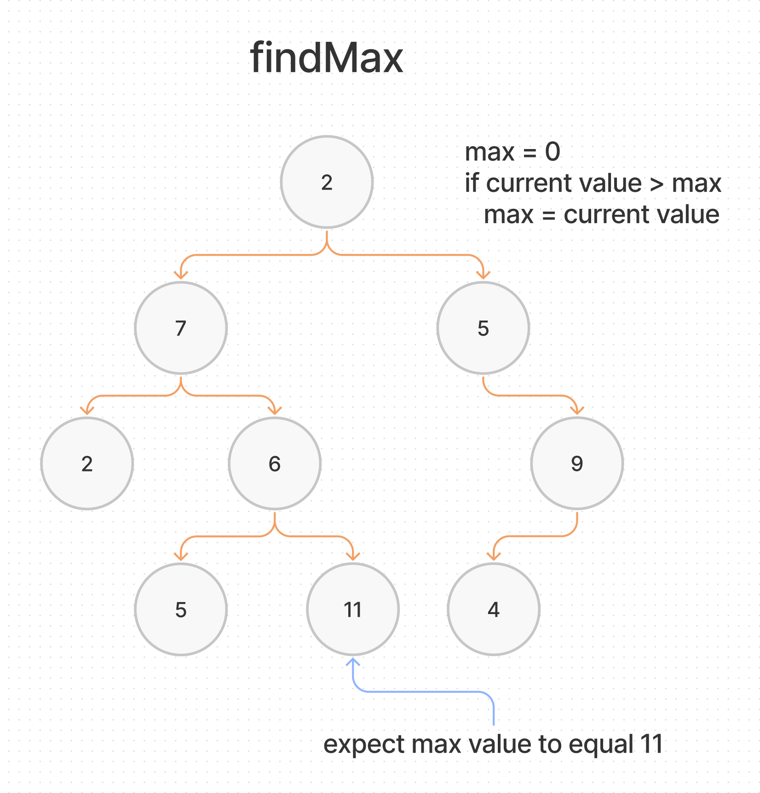

# Tree Max

## Challenge Summary

Find the Maximum Value in a Binary Tree

- Write the following method for the Binary Tree class:
  - Find maximum value
    - Arguments: none
    - Returns: number

### Input



### Output

```plaintext
11
```

## Whiteboard Process



## Approach & Efficiency

We will need to traverse the binary tree recursively using the pre-order method to validate from the current value.

- Each Node will be checked for a max value.
- To find the max value, it will take O(n) in time.

## Solution

- [Tree Max](./tree-max.js)
- [Test](./tree-max.tes.js)

[back](../README.md)
