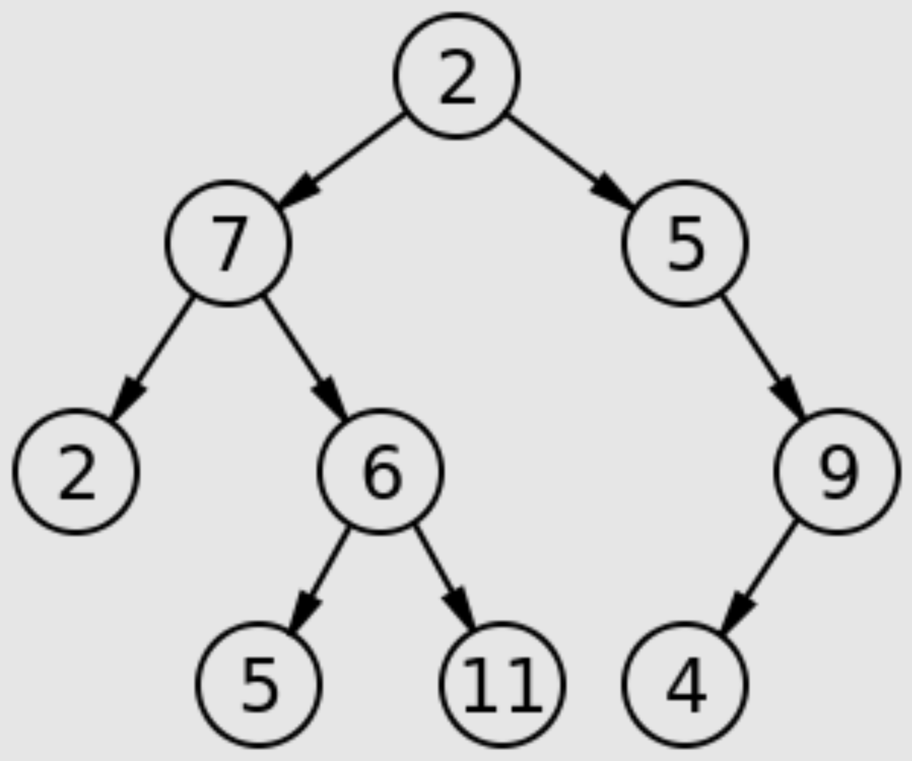
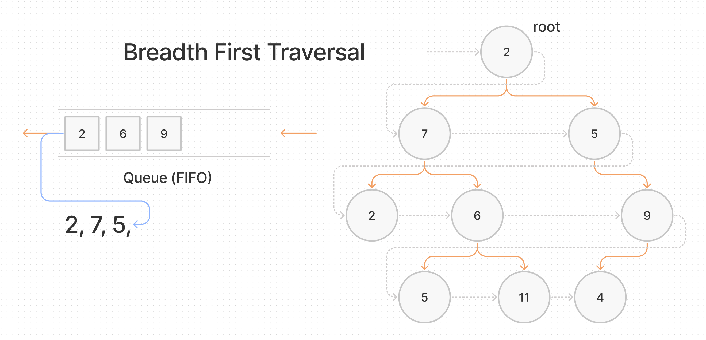

# Tree Breadth First

## Challenge Summary

- Write a function called breadth first
- Arguments: tree
- Return: list of all values in the tree, in the order they were encountered

*NOTE:* Traverse the input tree using a Breadth-first approach

### Input



### Output

```plaintext
[2,7,5,2,6,9,5,11,4]
```

## Whiteboard Process



## Approach & Efficiency

Using breadth first traversal, we will traverse the binary tree one level at a time, regardless of which side of the root we are on, before traversing to the next level below.

- In order to accomplish this, we will use a queue (First In First Out).
- We will have to store a Node's reference into the queue upon discovering that Node in the tree.
- When the Node in the queue becomes visited, we can dequeue that Node and discover / add it's children to the queue.
- Breadth first traversal will take O(n) in time.

## Solution

- [Tree Breadth First](./tree-breadth-first.js)
- [Test](./tree-breadth-first.test.js)

[back](../README.md)
