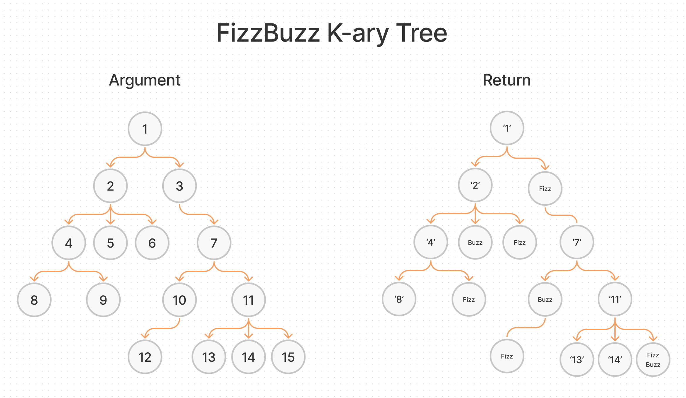

# Fizz Buzz Tree

## Challenge Summary

Conduct “FizzBuzz” on a k-ary tree while traversing through it to create a new tree.

Set the values of each of the new nodes depending on the corresponding node value in the source tree.

### Feature Tasks

- Write a function called fizz buzz tree
- Arguments: k-ary tree
- Return: new k-ary tree

Determine whether or not the value of each node is divisible by 3, 5 or both.

- Create a new tree with the same structure as the original, but the values modified as follows:
  - If the value is divisible by 3, replace the value with “Fizz”
  - If the value is divisible by 5, replace the value with “Buzz”
  - If the value is divisible by 3 and 5, replace the value with “FizzBuzz”
  - If the value is not divisible by 3 or 5, simply turn the number into a String.

## Whiteboard Process

## Approach & Efficiency

I first created a simple K-ary Tree with Nodes whose values were 1 through 15. I built my sample tree in my test suite along with the proper outputs by following my diagram. To traverse the tree, I used the breadth first approach by using a queue. I created a seperate function to calculate the values of each Node to check if they were divisible by 3 or 5. This approach takes O(n) in time.

## Solution

- [Fizz Buzz Tree](./tree-fizz-buzz.js)
- [Test](./tree-fizz-buzz.test.js)

[back](../README.md)
