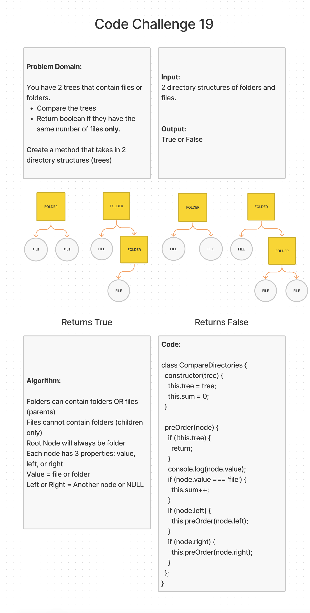

# Compare Directories

## Challenge Summary

You are working with a file structure with only at most 2 files or folder. Each file directory has either one or two folders/files.

### Feature Tasks

- Comparing two file different file directories, create a method that takes in 2 directory structures and compares both and determines whether or not they have the same number of individual files.

## Whiteboard Process

[back](../README.md)
