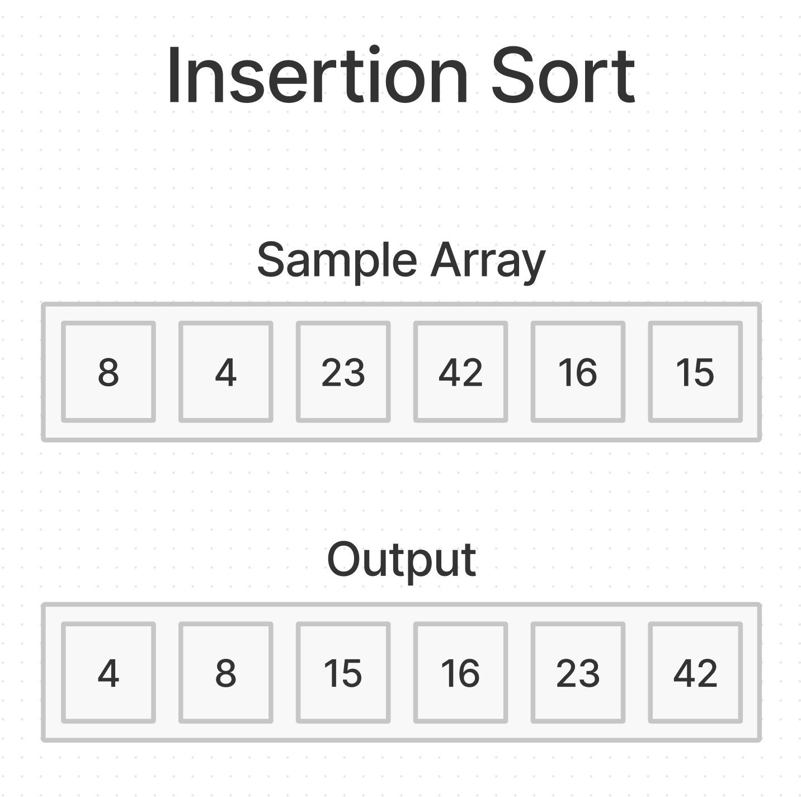

# Insertion Sort

Selection Sort analyzes scenarios beyond the worst case.



## Psuedocode

```plaintext
InsertionSort(int[] arr)

  FOR i = 1 to arr.length

    int j <-- i - 1
    int temp <-- arr[i]

    WHILE j >= 0 AND temp < arr[j]
      arr[j + 1] <-- arr[j]
      j <-- j - 1

    arr[j + 1] <-- temp
```

## Trace

Sample Array: `[8,4,23,42,16,15]`

Output: `[4,8,15,16,23,42]`

### Pass 1:

- Is index 1 less than index 0?
  - Yes - values are then swapped.
  - `[4,8,23,42,16,15]`

### Pass 2:

- Is index 2 less than index 1?
  - No - array is unchanged.

### Pass 3:

- Is index 3 less than index 2?
  - No - array is unchanged.

### Pass 4:

- Is index 4 less than index 3?
  - Yes - value is placed in a temp value while checking, and then swapped 2 index positions.
  - `[4,8,16,23,42,15]`

### Pass 5:

- Is index 5 less than index 4?
  - Yes - values are then swapped.
  - `[4,8,16,23,15,42]`

## Efficiency

- Time:
  - O(n^2), quadratic
- Space:
  - O(1), constant
