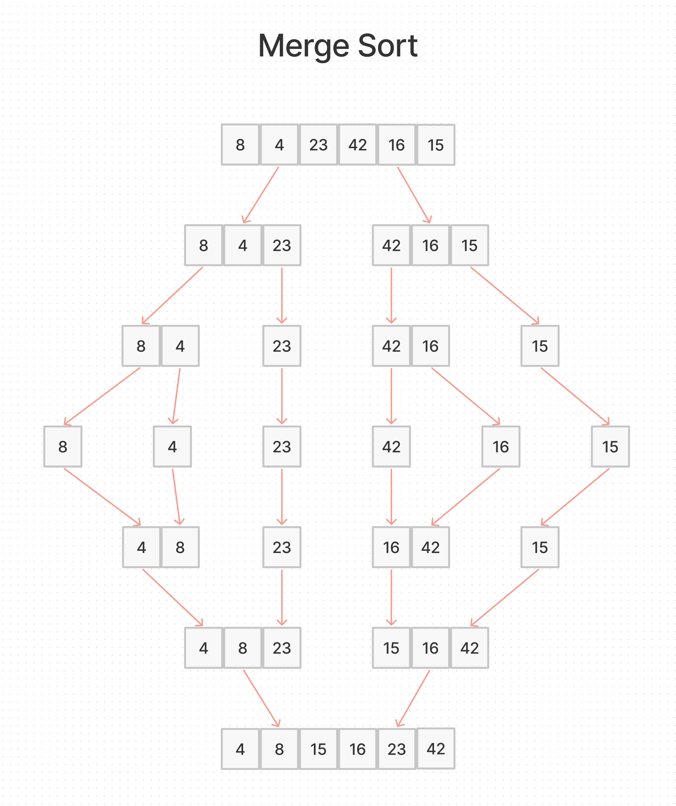

# Merge Sort

## Challenge Summary

Review the pseudocode below, then trace the algorithm by stepping through the process with the provided sample array.

## Psuedocode

```js
ALGORITHM Mergesort(arr)
    DECLARE n <-- arr.length

    if n > 1
      DECLARE mid <-- n/2
      DECLARE left <-- arr[0...mid]
      DECLARE right <-- arr[mid...n]
      // sort the left side
      Mergesort(left)
      // sort the right side
      Mergesort(right)
      // merge the sorted left and right sides together
      Merge(left, right, arr)

ALGORITHM Merge(left, right, arr)
    DECLARE i <-- 0
    DECLARE j <-- 0
    DECLARE k <-- 0

    while i < left.length && j < right.length
        if left[i] <= right[j]
            arr[k] <-- left[i]
            i <-- i + 1
        else
            arr[k] <-- right[j]
            j <-- j + 1

        k <-- k + 1

    if i = left.length
       set remaining entries in arr to remaining values in right
    else
       set remaining entries in arr to remaining values in left
```

## Sample Arrays

`[8,4,23,42,16,15]`

For your own understanding, consider also stepping through these inputs:

- Reverse-sorted: `[20,18,12,8,5,-2]`
- Few uniques: `[5,12,7,5,5,7]`
- Nearly-sorted: `[2,3,5,7,13,11]`

## Whiteboard Process



## Approach & Efficiency

## Solution

- [Merge Sort](./merge-sort.js)
- [Test](./merge-sort.test.js)

[back](../README.md)
