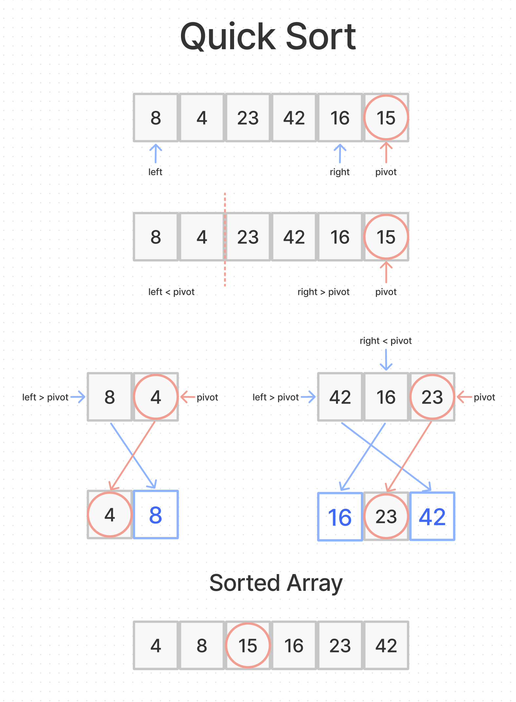

# Quick Sort

Quicksort is an extremely fast sorting algorithm that is particularly efficient for average scenarios. It relies on a concept called partitioning, which takes a random value from an array.

## Algorithm

1. Set the farthest right index to the pivot value.
2. Find first element on left that is great than pivot, and last element on right that is less than pivot and swap.
3. Repeat until all elements less than pivot are on left side, and all elements greater than pivot are on the right.
4. Split array in half and establish new pivots for sub-arrays and repeat process of swapping elements.
5. Once these halves are sorted, swap pivot back to its original index to have a quick sorted array.

## Psuedocode

```js
ALGORITHM QuickSort(arr, left, right)
    if left < right
        // Partition the array by setting the position of the pivot value
        DEFINE position <-- Partition(arr, left, right)
        // Sort the left
        QuickSort(arr, left, position - 1)
        // Sort the right
        QuickSort(arr, position + 1, right)

ALGORITHM Partition(arr, left, right)
    // set a pivot value as a point of reference
    DEFINE pivot <-- arr[right]
    // create a variable to track the largest index of numbers lower than the defined pivot
    DEFINE low <-- left - 1
    for i <- left to right do
        if arr[i] <= pivot
            low++
            Swap(arr, i, low)

     // place the value of the pivot location in the middle.
     // all numbers smaller than the pivot are on the left, larger on the right.
     Swap(arr, right, low + 1)
    // return the pivot index point
     return low + 1

ALGORITHM Swap(arr, i, low)
    DEFINE temp;
    temp <-- arr[i]
    arr[i] <-- arr[low]
    arr[low] <-- temp
```

## Trace

Sample Array: `[8,4,23,42,16,15]`



## Efficiency

- Time:
  - O(nlogn)
- Space:
  - O(nlogn)
