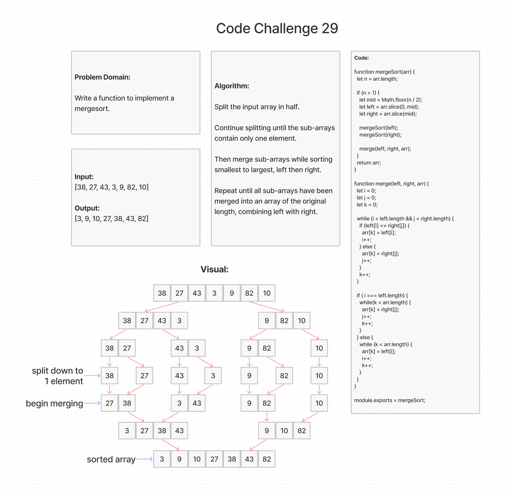

# Merge Sort

## Challenge Summary

Write a function to implement a mergesort.

### Feature Tasks

It should have at least 2 functions—traditionally, a `mergesort` and a `merge` function.

## Whiteboard Process

[back](../README.md)
