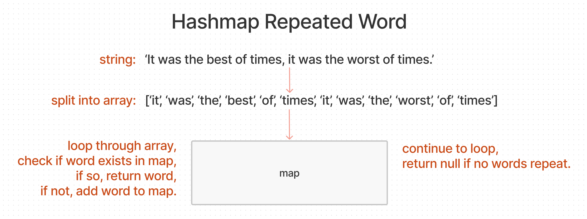

# Hashmap Repeated Word

## Challenge Summary

Find the first repeated word in a book.

### Feature Tasks

- Write a function called repeated word that finds the first word to occur more than once in a string
- Arguments: string
- Return: string

## Inputs / Outputs

| Input                                                                                                                             	| Output     	|
|-----------------------------------------------------------------------------------------------------------------------------------	|------------	|
| `"Once upon a time, there was a brave princess who..."`                                                                          	| `"a"`      	|
| `"It was the best of times, it was the worst of times, it was the age of wisdom..."`                                              	| `"it"`     	|
| `"It was a queer, sultry summer, the summer they electrocuted the Rosenbergs, and I didn’t know what I was doing in New York..."` 	| `"summer"` 	|

## Whiteboard Process

## Approach & Efficiency

- First we need to split a string into an array of words, using RegEx to take punctuation into account.
- We will then store this array of words in a hashmap as a Set using `toLowerCase()`.
- We will iterate through the array using a for loop, checking if the word is already in the map.
- If so, return the word, otherwise add the word to the map
- Return null if no words repeat.
- This will have an O(n) in both time and space.

## Solution

- [Hashmap Repeated Word](./hashmap-repeated-word.js)
- [Test](./hashmap-repeated-word.test.js)

[back](../README.md)
