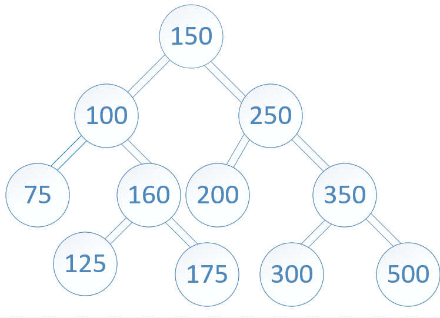
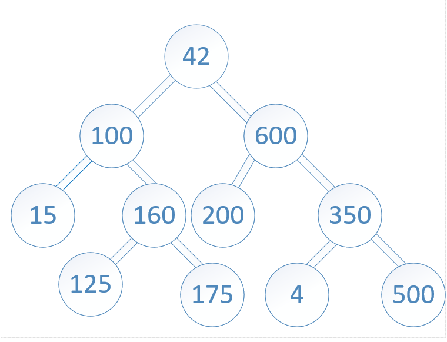
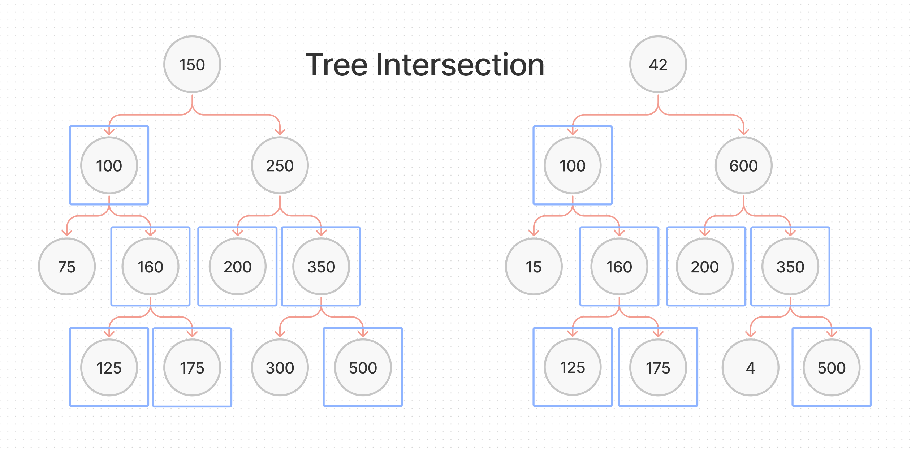

# Tree Intersection

## Challenge Summary

Find common values in 2 binary trees.

### Feature Tasks

- Write a function called `tree_intersection` that takes two binary trees as parameters.
- Using **your** Hashmap implementation as a part of your algorithm, return a set of values found in both trees.

## Input

Binary Tree 1:  
  
Binary Tree 2:  

## Output

`100,160,125,175,200,350,500`

## Whiteboard Process

## Approach & Efficiency

- Coming Soon...

## Solution

- [Tree Intersection](./tree-intersection.js)
- [Test](./tree-intersection.test.js)

[back](../README.md)
