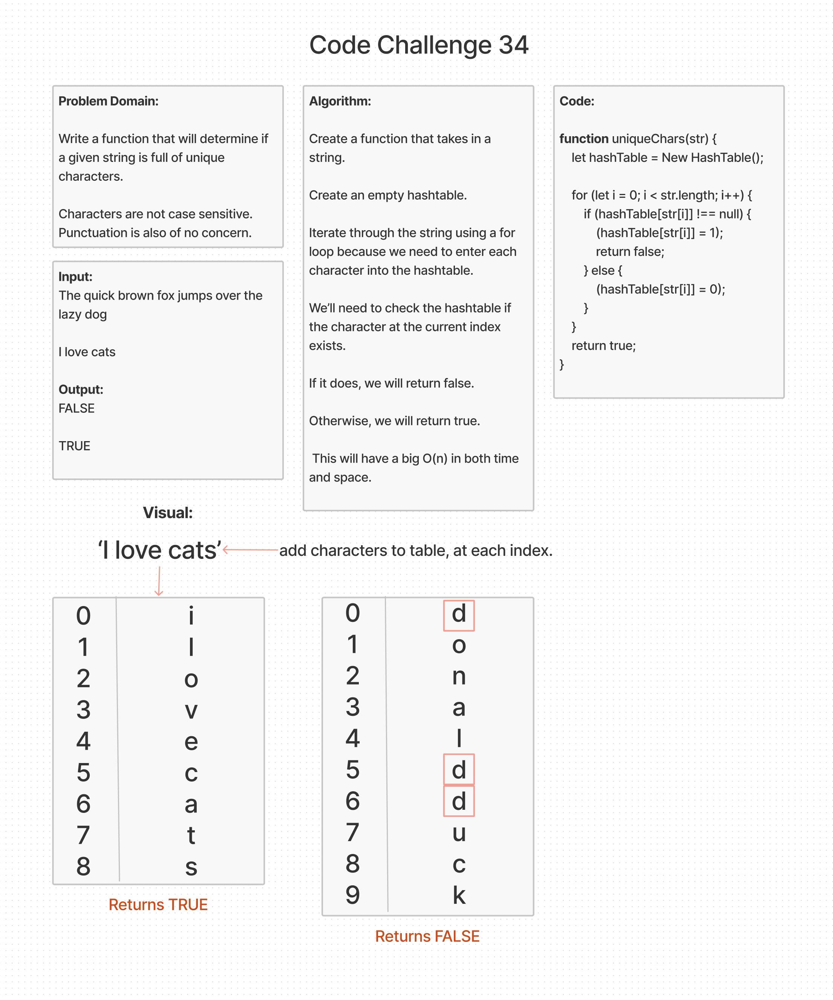

# String Unique Characters

## Challenge Summary

Write a function that will determine if a given string is full of unique characters.

### Feature Tasks

- Characters are no case sensitive.
- Do not be concerned about punctuation.

## Whiteboard Process

[back](../README.md)
