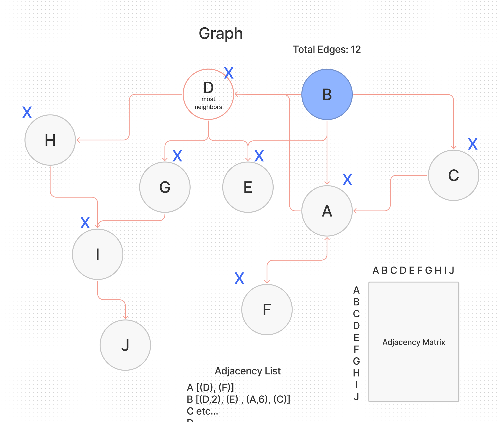
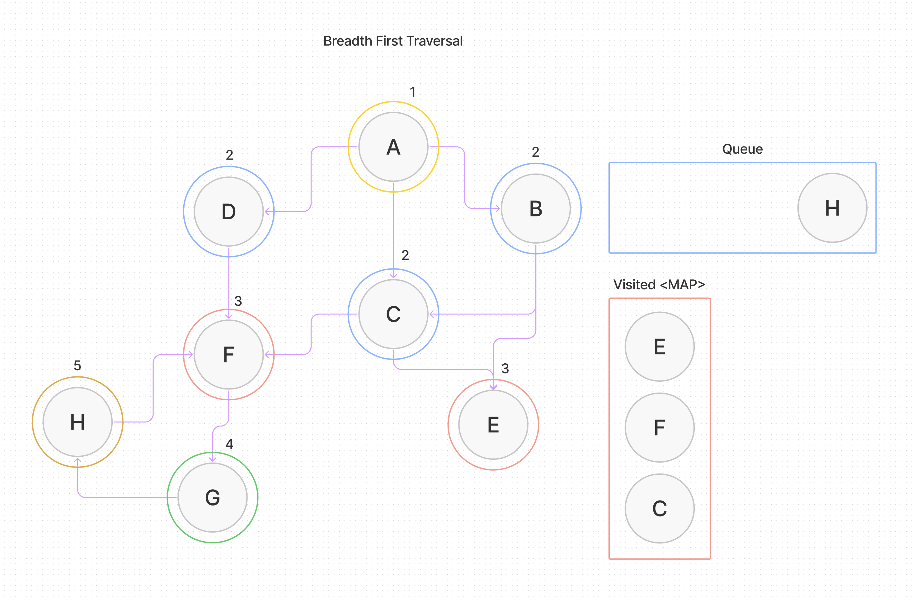
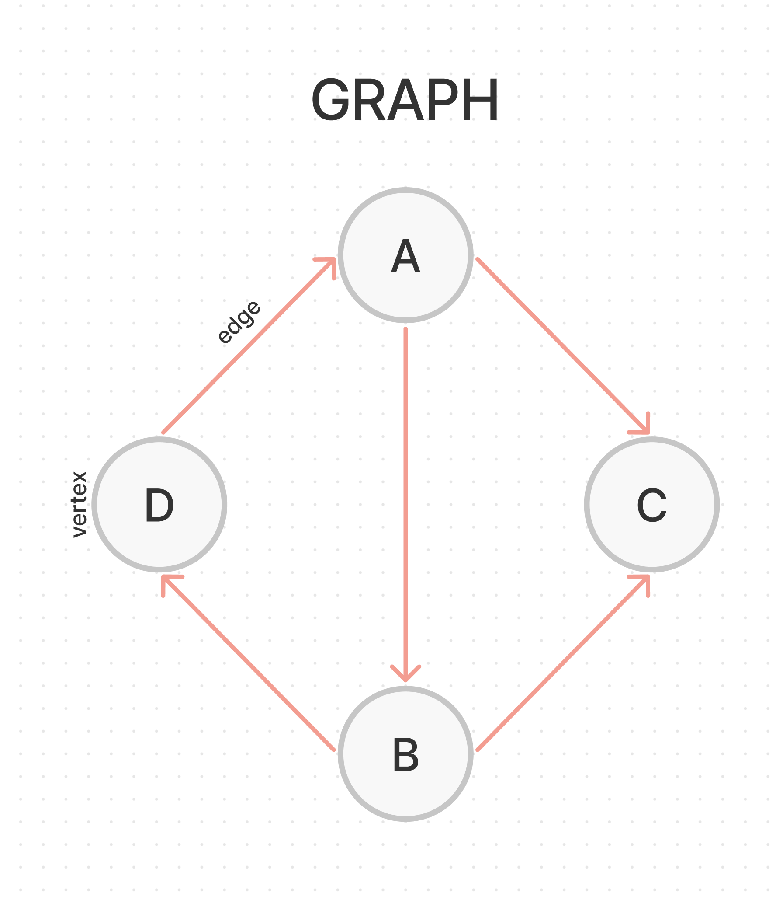

# Implementation: Graphs

A **graph** is a non-linear data structure

- A collection of `vertices` (or `nodes`) potentially connected by `edges`.

## Challenge

Implement your own Graph. The graph should be represented as an adjacency list.

## Approach & Efficiency

- What approach did you take? Why? What is the Big O space/time for this approach?

## API

The should should include the following methods:

- add node
  - Arguments: value
  - Returns: The added node
  - Add a node to the graph
- add edge
  - Arguments: 2 nodes to be connected by the edge, weight (optional)
  - Returns: nothing
  - Adds a new edge between two nodes in the graph
  - If specified, assign a weight to the edge
  - Both nodes should already be in the Graph
- get nodes
  - Arguments: none
  - Returns all of the nodes in the graph as a collection (set, list, or similar)
- get neighbors
  - Arguments: node
  - Returns a collection of edges connected to the given node
    - Include the weight of the connection in the returned collection
- size
  - Arguments: none
  - Returns the total number of nodes in the graph

## Whiteboard Process

  
  


### Implementation

```js
let A = graph.addVertex('A');
let B = graph.addVertex('B');
let C = graph.addVertex('C');
let D = graph.addVertex('D');

graph.addEdge(A, B);
graph.addEdge(A, C);
graph.addEdge(B, C);
graph.addEdge(B, D);
graph.addEdge(D, A);
```

## Code

- [Graph](./graph.js)
- [Test](./graph.test.js)

[back](../README.md)
