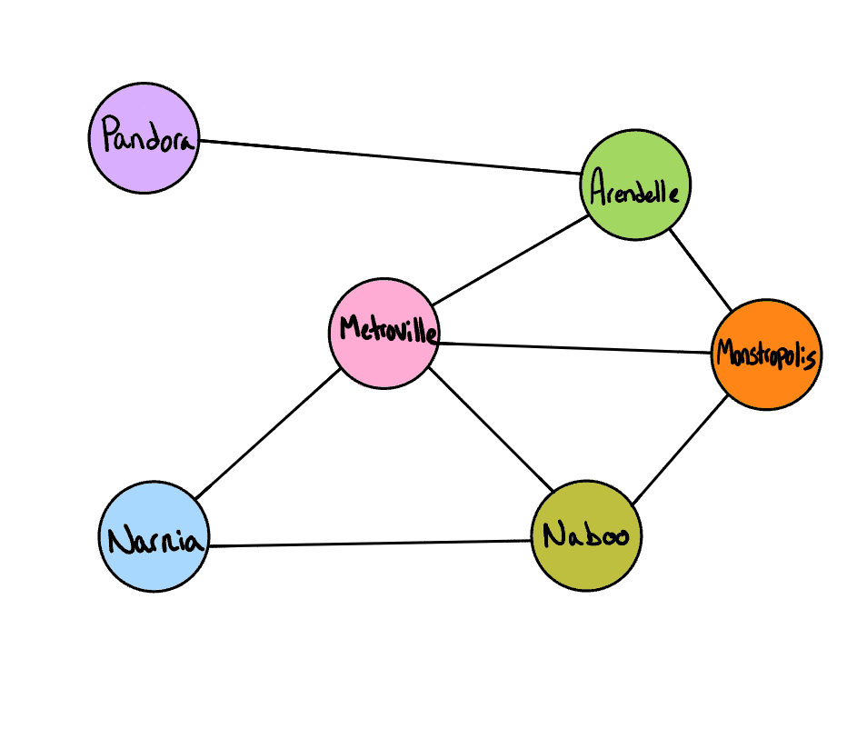
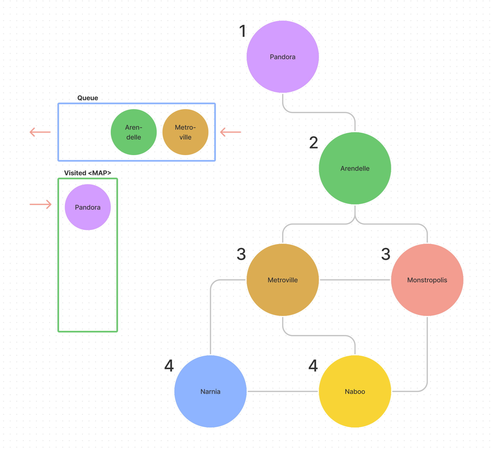

# Graph Breadth First Traversal

## Challenge Summary

Implement a breadth-first traversal on a graph.

### Feature Tasks

Write the following method for the Graph class:

- breadth first
  - Arguments: Node
  - Return: A collection of nodes in the order they were visited.
  - Display the collection

## Input



## Output

```plaintext
Pandora, Arendelle, Metroville, Monstropolis, Narnia, Naboo
```

## Whiteboard Process



## Approach & Efficiency

- Since we are given the output, I tried to think of this graph as being structurally similar to a K-ary tree for breadthfirst traversal, taking into account additional edges and potential directions, as we are given the expected output.
- In order to traverse this way, we will need to establish our starting vertex as well as an empty queue and keep track of our visited vertices using a Set.
- As vertices are visited, they are pushed into the queue. As traversal constinues, vertices are shifted from the queue and added to the Set.
- Once traversal is complete, we can return all vertices that have been visited.
- Time complexity is O(n).

## Solution

- [Graph Breadth First](./graph-breadth-first.js)
- [Test](./graph-breadth-first.test.js)

[back](../README.md)
