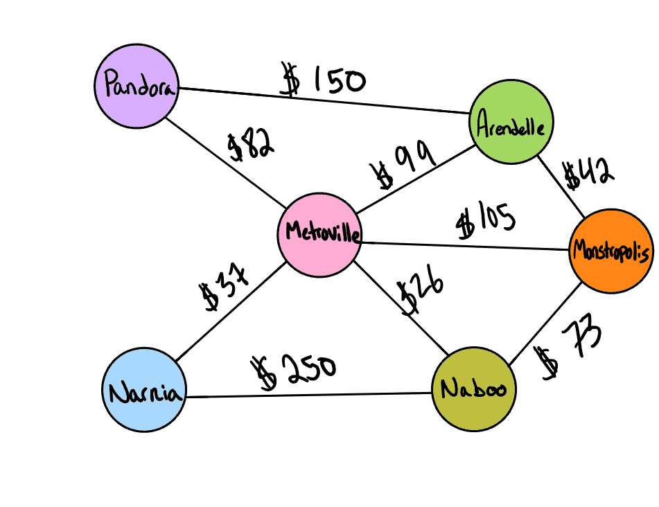

# Graph Business Trip

## Challenge Summary

Given a business trip itinerary, and an Alaska Airlines route map, is the trip possible with direct flights? If so, how much will the total trip cost be?

### Feature Tasks

- Write a function called business trip
- Arguments: graph, array of city names
- Return: cost or null

Determine whether the trip is possible with direct flights, and how much it would cost.

## Whiteboard Process

### Example



## Inputs / Outputs

```plaintext
| Input                                 | Output      |
|---------------------------------------|-------------|
| [Metroville, Pandora]                 | True, $82   |
| [Arendelle, New Monstropolis, Naboo]  | True, $115  |
| [Naboo, Pandora]                      | False, $0   |
| [Narnia, Arendelle, Naboo]            | False, $0   |
```

## Approach & Efficiency

- Since we are trying to check for direct flights, we have to use our getNeighbors method to check for neighbors of a vertex.
- We are adding weights to our edges and will need to calculate and return flight costs based on edge weights. We will declare our starting cost at 0.
- As we traverse, we will check for adjacent vertices and return True if the trip is possible along with the cost.
- Edge weights will be added together for multiple flights.
- Return false with a cost of $0 if trip is not possible / vertices are not adjacent.
- Big O Notation is linear at O(n) in time and quadratic at O(n^2) in space.

## Solution

- [Business Trip](./business-trip.js) // [Test](./business-trip.test.js)
- [Graph](./graph.js) // [Test](./graph.test.js)

[back](../README.md)
