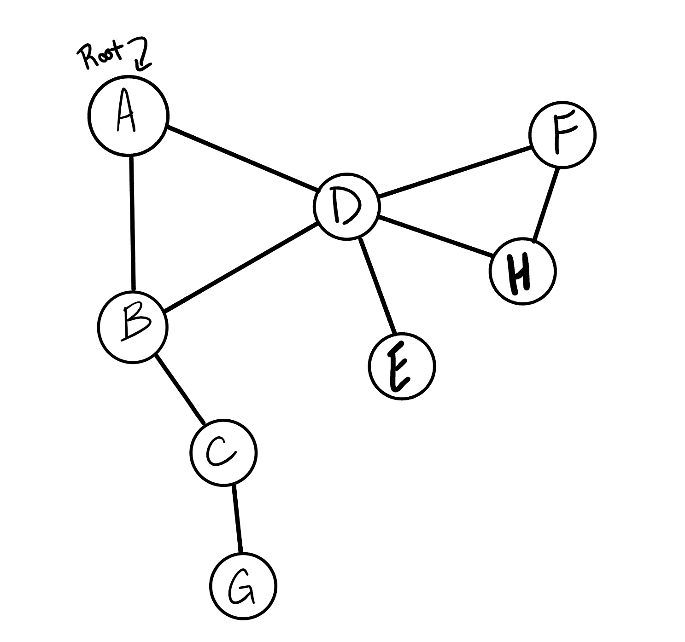

# Graph Depth First

## Challenge Summary

Conduct a depth first preorder traversal on a graph.

### Feature Tasks

Write the following method for the Graph class:

- Name: Depth first
- Arguments: Node (Starting point of search)
- Return: A collection of nodes in their pre-order depth-first traversal order
- Program output: Display the collection

## Whiteboard Process

### Input:



### Output:

```plaintext
A, B, C, G, D, E, H, F
```

## Approach & Efficiency

## Solution

- [Graph Depth First](./graph-depth-first.js)
- [Test](./graph-depth-first.test.js)

[back](../README.md)
